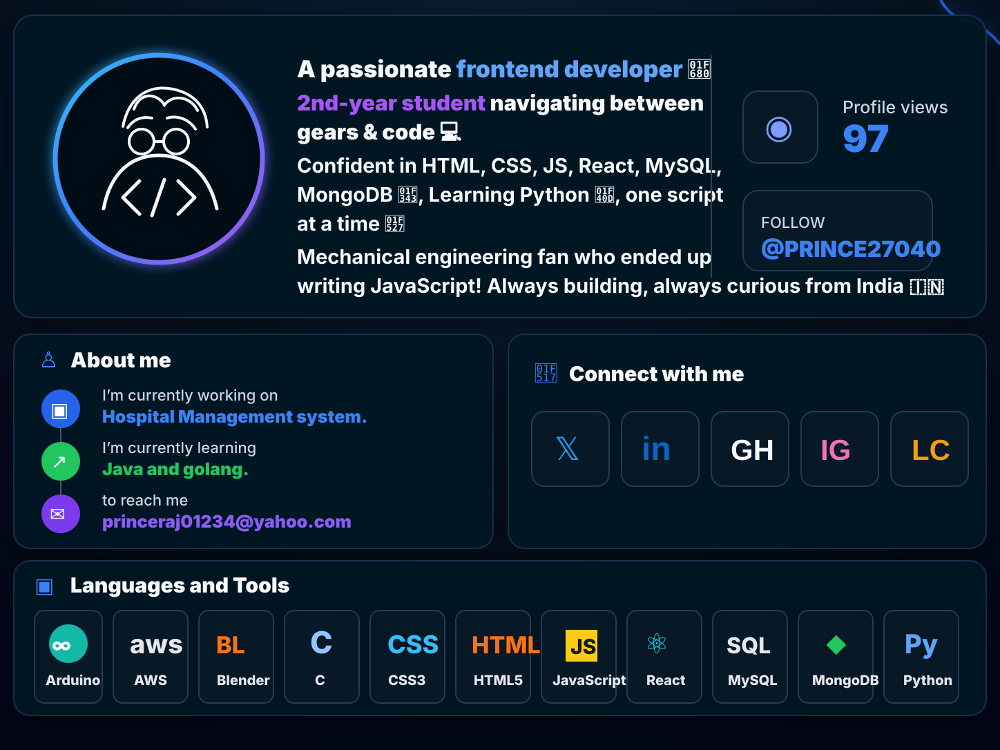

<!-- PROFESSIONAL GITHUB PROFILE README -->

  

 

  

 

  
  
  

 

<h2 align="center">👨‍💻 About Me</h2>

<table align="center">
  <tr>
    <td width="50%">
      <h3>🚀 Currently Working On</h3>
      

        I’m currently working on a <b>Hospital Management System</b>, focused on building a useful, clean, and practical software solution.
      

    </td>
    <td width="50%">
      <h3>🌱 Currently Learning</h3>
      

        I’m currently learning <b>Java</b> and <b>Golang</b> to improve my backend and system-level programming skills.
      

    </td>
  </tr>
  <tr>
    <td width="50%">
      <h3>💻 Main Skills</h3>
      

        HTML, CSS, JavaScript, React, MySQL, MongoDB, Python, Java, Golang, and C.
      

    </td>
    <td width="50%">
      <h3>📫 Reach Me</h3>
      

        <a href="mailto:princeraj01234@yahoo.com">
          <b>princeraj01234@yahoo.com</b>
        </a>
      

    </td>
  </tr>
</table>

 

<h2 align="center">🔗 Connect With Me</h2>

  
  
  
  
  

 

<h2 align="center">🛠️ Languages and Tools</h2>

  

 

<h2 align="center">📊 GitHub Analytics</h2>

  
  

 

  

 

<h2 align="center">📈 Contribution Graph</h2>

  

 

<h2 align="center">🚀 Featured Projects</h2>

<table align="center">
  <tr>
    <td width="50%">
      <h3 align="center">🏥 Hospital Management System</h3>
      

        A complete system for managing hospital operations, patients, doctors, appointments, and records.
      

      

        <b>Tech Stack:</b> HTML, CSS, JavaScript, MySQL
      

    </td>
    <td width="50%">
      <h3 align="center">💻 Frontend Projects</h3>
      

        Clean and responsive frontend designs built using modern web technologies.
      

      

        <b>Tech Stack:</b> HTML, CSS, JavaScript, React
      

    </td>
  </tr>
</table>

 

  

